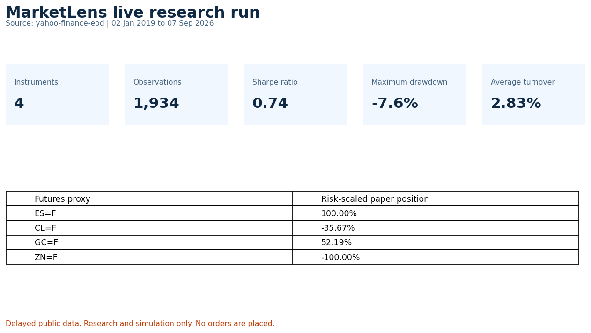

# MarketLens

> A reproducible global-futures research and paper-trading simulation lab.

MarketLens turns delayed, end-of-day futures proxies into a transparent trend and
volatility-regime research workflow. It is designed to demonstrate quantitative
research hygiene: lagged signals, explicit trading costs, leverage caps,
macro-event windows, and clear source limitations.

**It does not connect to a broker, place orders, or provide investment advice.**



## What it does

- Downloads real end-of-day price proxies for E-mini S&P 500 (`ES=F`), WTI crude
  oil (`CL=F`), gold (`GC=F`), and 10-year Treasury Note futures (`ZN=F`).
- Builds a transparent fast/slow trend signal with volatility targeting and a
  one-day execution lag to avoid look-ahead bias.
- Runs a cost-aware equal-weight paper simulation with turnover, drawdown,
  Sharpe, Calmar, hit-rate, and annualized return/volatility outputs.
- Produces fixed-rule sequential walk-forward test blocks rather than reporting
  only one in-sample result.
- Performs descriptive pre/event/post FOMC-window studies from a versioned local
  calendar.
- Reads key-free public Federal Reserve Economic Data (FRED) series through the
  API and weekly CFTC Traders in Financial Futures (TFF) positioning for E-mini
  S&P 500 and 10-year Treasury Notes.
- Offers both a Streamlit dashboard and a FastAPI API, plus a CLI that writes
  auditable CSV/JSON artifacts.

## Data sources and integrity

| Source | What MarketLens uses | Important limitation |
| --- | --- | --- |
| Yahoo Finance public chart endpoint | End-of-day continuous futures price proxies | Convenient research proxy; confirm contract rolls, settlement conventions, and licensing before serious analysis. |
| [CFTC TFF API](https://publicreporting.cftc.gov/stories/s/r4w3-av2u) | Weekly reportable positioning | Delayed weekly snapshot; it is not a real-time signal and covers reportable positions. |
| [FRED](https://fred.stlouisfed.org/docs/api/fred/series_observations.html) | Public macroeconomic time series | Revisions and frequency differences matter; align availability dates before inference. |
| [Federal Reserve FOMC calendar](https://www.federalreserve.gov/monetarypolicy/fomccalendars.htm) | Versioned sample event calendar | The bundled calendar is deliberately small; refresh it from the official calendar for new research. |

The CFTC makes historical TFF data and an unauthenticated API available; TFF
classifies reportable positions into dealer, asset-manager, leveraged-money,
other-reportable, and non-reportable categories. For contract-level, intraday,
or production-quality history, use a licensed exchange/vendor source such as
[CME market data](https://www.cmegroup.com/market-data/browse-data/catalog/futures-and-options-data.html).

## Quick start

```bash
python -m venv .venv
.venv/Scripts/activate           # Windows PowerShell
pip install -r requirements.txt

# Real end-of-day research run (default)
python run.py --source yahoo

# Reproducible offline demo; clearly labelled synthetic
python run.py --source synthetic

# Dashboard
streamlit run dashboard/app.py

# API docs: http://127.0.0.1:8000/docs
uvicorn marketlens.api:app --reload
```

The CLI writes `prices.csv`, positions, instrument returns, portfolio returns,
event-study data, and run metadata to `artifacts/`. The directory is excluded
from Git because every run should be reproducible from the inputs and config.

## API

```text
GET /health
GET /research/run?source=yahoo&fast_window=20&slow_window=100
GET /macro/CPIAUCSL
GET /positioning/ES
GET /positioning/ZN
```

## Research controls

- Signals are shifted one day before they can affect simulated returns.
- Transaction costs are set as a configurable one-way basis-point charge on
  absolute position changes.
- Per-instrument leverage is capped; portfolio results are equal-weighted.
- Event studies discard incomplete windows rather than silently use partial data.
- Walk-forward windows are chronological and fixed-rule; the app does not tune
  parameters between test windows.
- The dashboard labels synthetic data and every external-source limitation.

Read [the methodology](docs/METHODOLOGY.md) before interpreting any output.

## Development

```bash
pytest -q
docker compose up --build
```

The Docker compose stack serves the API on `:8000` and dashboard on `:8501`.
GitHub Actions runs the test suite on pushes and pull requests.

To regenerate the checked-in live-data GIF after a product change:

```bash
pip install -r requirements-dev.txt
python scripts/create_demo_gif.py
```

## Project structure

```text
marketlens/
  marketlens/
    core/         # signal, backtest, event-study calculations
    data/         # Yahoo, FRED, CFTC, and local-calendar adapters
    services/     # shared research orchestration
    api.py        # FastAPI surface (no execution endpoint)
  dashboard/      # Streamlit dashboard
  data/sample/    # versioned FOMC research calendar
  tests/          # no-look-ahead, cost, validation, event-window tests
```

## Resume-ready description (only after you run and document it)

**MarketLens - Global Futures Research & Paper-Trading Lab** | Python, pandas,
FastAPI, Streamlit, Plotly, CFTC, FRED

- Built a reproducible research pipeline using end-of-day futures data, weekly
  CFTC positioning, macroeconomic data, and FOMC event windows.
- Implemented lagged trend signals, volatility targeting, transaction costs,
  leverage caps, walk-forward-ready evaluation outputs, and risk metrics.
- Shipped a Dockerized Streamlit/FastAPI application with tests and CI; designed
  strictly for research and simulation, with no order-execution capability.

Do not add performance claims until you have checked in an artifact with the
exact date range, costs, data caveats, and reproducible configuration.
